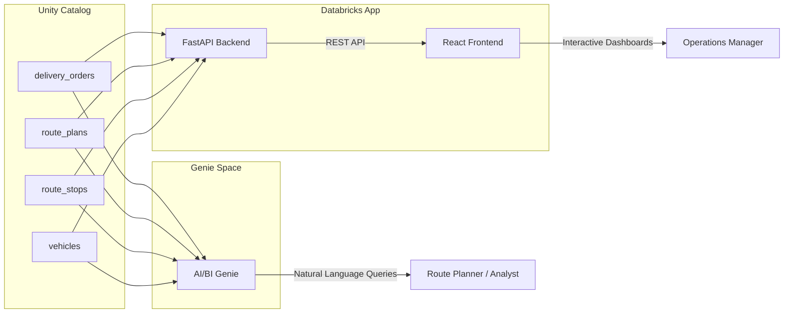
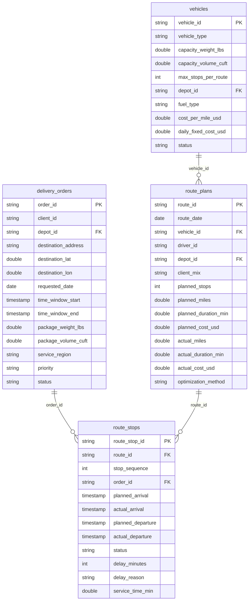

# NorthStar Logistics -- 3PL Route Optimization Demo

A complete Databricks demo for analyzing route efficiency, delivery performance, fleet utilization, and cost optimization for a third-party logistics operation.

Built on Unity Catalog, AI/BI Genie, and Databricks Apps.

---

## Table of Contents

1. [Overview](#overview)
2. [What's Included](#whats-included)
3. [Architecture](#architecture)
4. [Prerequisites](#prerequisites)
5. [Quick Start (pip install) -- 3 Minutes](#quick-start-pip-install----3-minutes)
6. [Quick Start (Notebook) -- 5 Minutes](#quick-start-notebook----5-minutes)
7. [Full Setup (Tables + Genie + App) -- 10 Minutes](#full-setup-tables--genie--app----10-minutes)
7. [Data Model](#data-model)
8. [Key Metrics](#key-metrics)
9. [Genie Sample Questions](#genie-sample-questions)
10. [App Pages](#app-pages)
11. [Configuration Options](#configuration-options)
12. [Troubleshooting](#troubleshooting)
13. [Customization](#customization)
14. [Repository Structure](#repository-structure)
15. [License](#license)

---

## Overview

**NorthStar Logistics** is a fictional third-party logistics (3PL) company that operates last-mile and regional delivery services for multiple clients. This demo generates a realistic synthetic dataset and deploys interactive analytics tooling on top of it.

The scenario models a full year of delivery operations across the following dimensions:

| Dimension | Details |
|---|---|
| Depots | 8 US metro areas: Atlanta, Chicago, Dallas, Denver, Los Angeles, New York, Phoenix, Seattle |
| Client Programs | 5 programs: CLIENT_A, CLIENT_B, CLIENT_C, CLIENT_D, CLIENT_E |
| Fleet | 40 vehicles across 6 types: sprinter van, box truck, 26ft truck, cargo van, refrigerated van, flatbed |
| Optimization Methods | `greedy_nearest` (nearest-neighbor heuristic), `or_tools_cvrp` (Google OR-Tools CVRP solver), `manual_dispatch` (dispatcher-assigned) |
| Time Range | January 2025 through December 2025 (12 months) |
| Data Volume | 91,000+ rows across 4 tables |

The data includes realistic seasonal patterns (Q4 holiday surge, back-to-school August spike, post-holiday January dip), day-of-week effects (heavier Monday--Friday, lighter weekends), geographic clustering of delivery destinations around depot metro areas, and Pareto distributions for client and depot volume.

---

## What's Included

| Component | Description |
|---|---|
| `deploy_notebook.py` | One-click Databricks notebook that creates the Unity Catalog tables, configures the Genie space, and optionally deploys the Databricks App. Run this single file to set up everything. |
| Genie Data Room | A pre-configured AI/BI Genie space with general instructions, 7 sample questions, 5 example SQL queries, metric definitions, and column-level entity matching. Enables natural language querying of the delivery data. |
| Databricks App | A React + FastAPI dashboard application with 4 pages: Route Dashboard, Route Map, Fleet & Vehicle, and Delay Analysis. Reads directly from the Unity Catalog tables via the Databricks SQL Connector. |
| `create_genie_space.py` | Standalone Python script for creating or recreating the Genie space outside of the deployment notebook. |
| [Google Sheets Planning Template](https://docs.google.com/spreadsheets/d/1i9JY2uHiGI1x-8AyScXPE6wCodH7Y9x1obrUY0uXHD4/edit) | Pre-filled planning template documenting the scenario, table schemas, metrics, and sample questions. |

---

## Architecture



**Data flow:**

- **Genie path:** Unity Catalog tables are registered as data sources in the Genie space. Users ask questions in natural language. Genie translates them to SQL, executes against the SQL warehouse, and returns results.
- **App path:** The FastAPI backend connects to the same Unity Catalog tables via the Databricks SQL Connector. It exposes REST endpoints (`/api/kpis`, `/api/routes`, `/api/delays`, etc.) that the React frontend consumes to render charts, maps, and tables.

---

## Prerequisites

Before deploying, confirm you have the following:

1. **Databricks workspace with Unity Catalog enabled**
   The deployment notebook creates a catalog and schema. Unity Catalog must be available on your workspace.

2. **SQL Warehouse (Pro or Serverless)**
   Required for Genie space queries and for the App backend. Serverless is recommended for fastest cold-start times.

3. **CREATE CATALOG permission** (or an existing catalog you can write to)
   The notebook will attempt to create a catalog named after your username. If you lack `CREATE CATALOG` privileges, set the `catalog_name` widget to an existing catalog where you have `CREATE SCHEMA` rights.

4. **Databricks Apps enabled** (optional, for the dashboard app)
   If your workspace does not have Databricks Apps enabled, set the `deploy_app` widget to `false` and skip the app deployment.

5. **Git integration configured** (for cloning the repo)
   You will clone this repo into a Databricks Repos / Git folder. Ensure your workspace has Git credentials configured.

---

## Quick Start (pip install) -- 3 Minutes

The fastest way to deploy. In any Databricks notebook:

```python
%pip install git+https://github.com/macumberc/route-optimization.git
```

```python
from northstar_route_optimization import deploy, cleanup

# Deploy tables + Genie space (pass your warehouse ID to create the Genie room)
result = deploy(spark, dbutils, warehouse_id="<your_warehouse_id>")

# result contains: catalog, schema, tables, genie_space_id, genie_url
print(result)
```

To tear everything down when you are done:

```python
from northstar_route_optimization import cleanup

cleanup(spark, dbutils,
        catalog=result["catalog"],
        genie_space_id=result.get("genie_space_id"))
```

---

## Quick Start (Notebook) -- 5 Minutes

Use this path if you prefer running a notebook directly or want to customize the SQL.

**Step 1: Clone the repo**

In your Databricks workspace, navigate to **Workspace > Repos** (or **Workspace > Git folders**) and clone this repository:

```
https://github.com/macumberc/route-optimization.git
```

**Step 2: Open the deployment notebook**

Navigate to the cloned repo and open `deploy_notebook.py`.

**Step 3: Review widget defaults**

At the top of the notebook you will see four widgets. For a tables-only deployment, leave all of them at their defaults:

| Widget | Default | Notes |
|---|---|---|
| `catalog_name` | Your Databricks username | Override if you want a shared catalog |
| `schema_name` | `demo` | Tables will be created here |
| `warehouse_id` | *(empty)* | Leave blank to skip Genie creation |
| `deploy_app` | `false` | Leave as `false` to skip app deployment |

**Step 4: Run All**

Click **Run All** in the notebook toolbar. The notebook will:

1. Create the catalog (if it does not exist) and schema
2. Generate all four tables with 91,000+ rows of synthetic data using pure SQL (no external dependencies)
3. Add column comments to every column
4. Print the fully qualified table names at the bottom

**Step 5: Query the tables**

Tables are now available at `<catalog_name>.<schema_name>.<table_name>`. Open a SQL editor or notebook and start querying:

```sql
SELECT
    depot_id,
    ROUND(AVG(actual_cost_usd / planned_stops), 2) AS avg_cost_per_delivery,
    ROUND(AVG(actual_miles / planned_stops), 2) AS avg_miles_per_stop
FROM <your_catalog>.demo.route_plans
GROUP BY depot_id
ORDER BY avg_cost_per_delivery DESC;
```

---

## Full Setup (Tables + Genie + App) -- 10 Minutes

This path deploys everything: tables, Genie space, and the interactive dashboard app.

**Step 1: Clone the repo**

Same as Quick Start Step 1 above.

**Step 2: Open the deployment notebook**

Open `deploy_notebook.py` from the cloned repo.

**Step 3: Find your SQL Warehouse ID**

You need the warehouse ID for both the Genie space and the App backend:

1. In your workspace, go to **SQL > SQL Warehouses** (or **Compute > SQL Warehouses**)
2. Click on the warehouse you want to use
3. The warehouse ID is in the URL: `https://<workspace>/sql/warehouses/<WAREHOUSE_ID>`
4. Copy the ID (e.g., `148ccb90800933a1`)

**Step 4: Set widget values**

Configure the notebook widgets:

| Widget | Value | Required |
|---|---|---|
| `catalog_name` | Your preferred catalog name (default: your username) | Yes |
| `schema_name` | `demo` (default) | Yes |
| `warehouse_id` | Your SQL Warehouse ID from Step 3 | Yes, for Genie + App |
| `deploy_app` | `true` | Yes, for App deployment |

**Step 5: Run All**

Click **Run All**. The notebook will:

1. Create the catalog and schema
2. Generate all four tables (91,000+ rows)
3. Add column comments
4. Create a fully configured Genie space with instructions, sample questions, example SQL, and benchmarks
5. Deploy the Databricks App with the correct catalog, schema, and warehouse configuration
6. Print clickable links at the bottom of the notebook

**Step 6: Open the Genie space**

Click the Genie space link printed in the notebook output. The space opens with 7 pre-loaded sample questions on the landing page.

Try asking:

> "Which routes had the highest cost per delivery last month?"

**Step 7: Open the App**

Click the App link printed in the notebook output. The dashboard loads with the Route Dashboard page showing KPI cards, charts, and the routes table.

**Step 8: Explore**

- Use the **Route Map** page to see delivery stops plotted geographically, color-coded by delay status
- Use the **Fleet & Vehicle** page to compare vehicle types by cost and utilization
- Use the **Delay Analysis** page to drill into delay reasons by month and region

---

## Data Model

The dataset consists of 4 tables linked by foreign key relationships.

### Entity Relationship Diagram



### Table: `delivery_orders`

Individual delivery requests submitted by clients.

| Column | Type | Description |
|---|---|---|
| `order_id` | STRING | Primary key. Unique delivery order identifier. |
| `client_id` | STRING | Client program identifier. Values: `CLIENT_A` through `CLIENT_E`. |
| `depot_id` | STRING | Originating depot. Values: `DEPOT_ATL`, `DEPOT_CHI`, `DEPOT_DAL`, `DEPOT_DEN`, `DEPOT_LAX`, `DEPOT_NYC`, `DEPOT_PHX`, `DEPOT_SEA`. |
| `destination_address` | STRING | Delivery destination street address. |
| `destination_lat` | DOUBLE | Destination latitude, clustered within ~50 miles of the depot metro area. |
| `destination_lon` | DOUBLE | Destination longitude, clustered within ~50 miles of the depot metro area. |
| `requested_date` | DATE | Date the delivery was requested for. |
| `time_window_start` | TIMESTAMP | Start of the customer's preferred delivery window. |
| `time_window_end` | TIMESTAMP | End of the customer's preferred delivery window. |
| `package_weight_lbs` | DOUBLE | Package weight in pounds. Distributions vary by client. |
| `package_volume_cuft` | DOUBLE | Package volume in cubic feet. |
| `service_region` | STRING | Service region the destination falls within. 5 regions across the US. |
| `priority` | STRING | Order priority. Values: `standard`, `express`, `same_day`. |
| `status` | STRING | Order fulfillment status. Values: `delivered`, `in_transit`, `pending`, `cancelled`. |

### Table: `route_plans`

Daily planned and executed routes. Each row is one route assigned to one vehicle on one day.

| Column | Type | Description |
|---|---|---|
| `route_id` | STRING | Primary key. Unique route identifier. |
| `route_date` | DATE | Date the route was planned for. |
| `vehicle_id` | STRING | Foreign key to `vehicles.vehicle_id`. |
| `driver_id` | STRING | Driver assigned to the route. |
| `depot_id` | STRING | Depot the route originates from. |
| `client_mix` | STRING | Comma-separated list of client IDs served on this route. |
| `planned_stops` | INT | Number of stops planned for the route. |
| `planned_miles` | DOUBLE | Total miles planned. |
| `planned_duration_min` | DOUBLE | Planned route duration in minutes. |
| `planned_cost_usd` | DOUBLE | Estimated cost (fuel + driver + fixed). |
| `actual_miles` | DOUBLE | Actual miles driven. May exceed planned due to traffic, detours, or access issues. |
| `actual_duration_min` | DOUBLE | Actual route duration in minutes. |
| `actual_cost_usd` | DOUBLE | Actual total cost incurred. |
| `optimization_method` | STRING | How the route was optimized. Values: `greedy_nearest` (nearest-neighbor heuristic), `or_tools_cvrp` (Google OR-Tools CVRP solver), `manual_dispatch` (dispatcher-assigned). |

### Table: `route_stops`

Individual stops within each route. Links routes to delivery orders.

| Column | Type | Description |
|---|---|---|
| `route_stop_id` | STRING | Primary key. Unique stop identifier. |
| `route_id` | STRING | Foreign key to `route_plans.route_id`. |
| `stop_sequence` | INT | Order of this stop within the route (1-based). |
| `order_id` | STRING | Foreign key to `delivery_orders.order_id`. |
| `planned_arrival` | TIMESTAMP | Planned arrival time at the stop. |
| `actual_arrival` | TIMESTAMP | Actual arrival time. NULL if stop was skipped. |
| `planned_departure` | TIMESTAMP | Planned departure time from the stop. |
| `actual_departure` | TIMESTAMP | Actual departure time. |
| `status` | STRING | Stop outcome. Values: `completed`, `attempted`, `skipped`, `rescheduled`. |
| `delay_minutes` | INT | Minutes of delay beyond the planned arrival. 0 means on-time. |
| `delay_reason` | STRING | Reason for the delay, if any. Values: `traffic`, `customer_not_available`, `access_issue`, `weather`, `vehicle_breakdown`, or NULL (no delay). |
| `service_time_min` | DOUBLE | Time spent at the stop in minutes (unloading, signature, etc.). |

### Table: `vehicles`

Fleet inventory and specifications.

| Column | Type | Description |
|---|---|---|
| `vehicle_id` | STRING | Primary key. Unique vehicle identifier. |
| `vehicle_type` | STRING | Vehicle class. Values: `sprinter_van`, `box_truck`, `26ft_truck`, `cargo_van`, `refrigerated_van`, `flatbed`. |
| `capacity_weight_lbs` | DOUBLE | Maximum payload weight in pounds. |
| `capacity_volume_cuft` | DOUBLE | Maximum payload volume in cubic feet. |
| `max_stops_per_route` | INT | Maximum number of stops this vehicle can handle per route. |
| `depot_id` | STRING | Home depot for this vehicle. |
| `fuel_type` | STRING | Fuel/power source. Values: `diesel`, `gasoline`, `electric`, `hybrid`. |
| `cost_per_mile_usd` | DOUBLE | Variable cost per mile driven. |
| `daily_fixed_cost_usd` | DOUBLE | Fixed daily cost (insurance, depreciation, etc.). |
| `status` | STRING | Current vehicle status. Values: `active`, `maintenance`, `retired`. |

---

## Key Metrics

The following metrics are pre-configured in the Genie space instructions and are used throughout the dashboard app.

### 1. On-Time Delivery Rate

Percentage of deliveries that arrived within the customer's delivery window.

```sql
SELECT
    ROUND(
        SUM(CASE WHEN rs.delay_minutes = 0 THEN 1 ELSE 0 END) * 100.0
        / COUNT(*),
        1
    ) AS on_time_rate
FROM route_stops rs
WHERE rs.status = 'completed';
```

**Target:** 95%+

### 2. Cost Per Delivery

Average cost incurred per delivery stop on a route.

```sql
SELECT
    ROUND(AVG(rp.actual_cost_usd / rp.planned_stops), 2) AS cost_per_delivery
FROM route_plans rp;
```

**Goal:** Lower is better. Benchmark varies by region and vehicle type.

### 3. Miles Per Stop

Average distance driven per delivery stop. Lower values indicate denser, more efficient routing.

```sql
SELECT
    ROUND(AVG(rp.actual_miles / rp.planned_stops), 2) AS miles_per_stop
FROM route_plans rp;
```

**Interpretation:** Urban depots (NYC, Chicago) will have lower values than rural/suburban depots (Denver, Phoenix).

### 4. Vehicle Utilization

Percentage of fleet actively running routes over a given period.

```sql
SELECT
    ROUND(
        COUNT(DISTINCT rp.vehicle_id) * 100.0
        / (SELECT COUNT(*) FROM vehicles WHERE status = 'active'),
        1
    ) AS fleet_utilization_pct
FROM route_plans rp
WHERE rp.route_date BETWEEN '2025-01-01' AND '2025-12-31';
```

**Target:** 75%+ active utilization.

### 5. Route Efficiency

Ratio of planned miles to actual miles driven. Closer to 100% means less deadhead mileage and fewer detours.

```sql
SELECT
    ROUND(AVG(rp.planned_miles / rp.actual_miles) * 100, 1) AS route_efficiency_pct
FROM route_plans rp
WHERE rp.actual_miles > 0;
```

**Interpretation:** Values below 85% suggest significant route deviation.

### 6. Late Delivery Rate

Percentage of stops that arrived after the planned time. Inverse of on-time rate when counting all delays.

```sql
SELECT
    ROUND(
        SUM(CASE WHEN rs.delay_minutes > 0 THEN 1 ELSE 0 END) * 100.0
        / COUNT(*),
        1
    ) AS late_delivery_rate
FROM route_stops rs
WHERE rs.status = 'completed';
```

**Target:** Below 10%.

---

## Genie Sample Questions

The Genie space ships with 7 sample questions on the landing page. Each demonstrates a different analytical angle.

| # | Question | What It Analyzes |
|---|---|---|
| 1 | Which routes had the highest cost per delivery last month? | Identifies the most expensive routes by dividing actual cost by stop count. Useful for finding routes that need re-optimization. |
| 2 | What is our on-time delivery rate by depot and week? | Tracks the weekly on-time trend at each depot. Surfaces depots with declining performance. |
| 3 | Which service regions have the most late deliveries, and what are the top delay reasons? | Combines regional analysis with root-cause breakdown. Answers both "where" and "why" for late deliveries. |
| 4 | What is our average vehicle utilization by vehicle type? | Compares how intensively each vehicle class is used. Highlights underutilized or over-stressed vehicle types. |
| 5 | How does miles-per-stop compare across depots? | Reveals routing density differences across geographies. Urban depots should show lower miles-per-stop than suburban/rural ones. |
| 6 | Which clients have the worst on-time performance this quarter? | Ranks client programs by delivery reliability. Useful for client-facing SLA reviews. |
| 7 | What are the busiest depots by stop count, and are they hitting vehicle capacity limits? | Identifies depots approaching fleet capacity. Supports decisions on fleet expansion or rebalancing. |

---

## App Pages

The Databricks App provides four dashboard pages accessible via the top navigation bar.

### 1. Route Dashboard (Home)

The default landing page provides a high-level operational overview.

- **KPI Cards:** On-Time Rate, Cost Per Delivery, Miles Per Stop, Fleet Utilization, Total Deliveries, Late Delivery Rate
- **Filters:** Date range picker, depot selector, client selector, service region selector. All charts and the routes table update when filters change.
- **Cost per Delivery by Depot:** Bar chart comparing average cost per delivery across all 8 depots
- **Route Efficiency Trend:** Line chart showing route efficiency over the most recent date windows
- **Active Routes Table:** Sortable, paginated table of routes with columns for depot, vehicle, stops, planned vs. actual miles, optimization method, and cost

### 2. Route Map

An interactive geographic view of delivery operations.

- **Map:** Full-screen Leaflet map centered on the continental US. Depot locations are displayed as blue markers. Delivery stops are plotted as circle markers color-coded by delay status:
  - Green: on-time (0 minutes delay)
  - Gold: minor delay (1--15 minutes)
  - Red: significant delay (>15 minutes)
- **Popups:** Click any depot marker to see its name and total stop count. Click any stop marker to see the stop sequence number, route ID, order ID, delay minutes, and address.
- **Filters:** Date picker and depot selector to narrow the view to a specific day or depot

### 3. Fleet & Vehicle

Fleet-level analytics for capacity planning and cost management.

- **Vehicle Status Breakdown:** Pie chart showing the count of vehicles by status (active, maintenance, retired)
- **Avg Cost per Mile by Vehicle Type:** Bar chart comparing operating costs across the 6 vehicle types
- **Routes per Vehicle Type:** Bar chart showing total route assignments by vehicle class
- **Vehicle Fleet Table:** Detailed table with vehicle ID, type, depot, capacity, max stops, cost per mile, total routes, average miles per route, and current status

### 4. Delay Analysis

Root-cause analysis of late deliveries.

- **Delay Reasons by Month:** Stacked bar chart showing the count of delays by reason (traffic, customer not available, access issue, weather, vehicle breakdown) for each month. Reveals seasonal patterns in delay causes.
- **Late Deliveries by Region:** Bar chart comparing the total delayed stops across service regions
- **Delay Reason Distribution:** Horizontal bar chart showing the aggregate count of each delay reason
- **Top 10 Worst Routes by Delay:** Table listing the routes with the highest total delay minutes, including depot, date, vehicle, and count of delayed stops. Rows with >60 minutes total delay are highlighted in red.

---

## Configuration Options

The deployment notebook uses Databricks widgets for configuration. All parameters have sensible defaults.

| Widget | Type | Default | Description |
|---|---|---|---|
| `catalog_name` | Text | Current user's Databricks username | Unity Catalog catalog to create or use. The notebook runs `CREATE CATALOG IF NOT EXISTS`. If you lack `CREATE CATALOG` permission, set this to an existing catalog. |
| `schema_name` | Text | `demo` | Schema within the catalog. Created with `CREATE SCHEMA IF NOT EXISTS`. |
| `warehouse_id` | Text | *(empty)* | SQL Warehouse ID for the Genie space and App backend. If left empty, Genie space creation is skipped. Find the ID at Compute > SQL Warehouses > click warehouse > look at the URL. |
| `deploy_app` | Text | `false` | Set to `true` to deploy the Databricks App. Requires Databricks Apps to be enabled on your workspace. |

### Environment Variables (App)

The deployed app reads these environment variables, which are set in `app/app.yaml`:

| Variable | Description |
|---|---|
| `CATALOG_NAME` | Catalog containing the data tables |
| `SCHEMA_NAME` | Schema containing the data tables |
| `DATABRICKS_WAREHOUSE_ID` | SQL Warehouse ID for backend queries (also configured as a resource in `app.yaml`) |

---

## Troubleshooting

### "Permission denied: CREATE CATALOG"

**Cause:** Your account does not have `CREATE CATALOG` privileges on this workspace.

**Fix:** Set the `catalog_name` widget to an existing catalog where you have `CREATE SCHEMA` and `CREATE TABLE` permissions. For example, if a shared catalog called `demos` exists:

```python
catalog_name = "demos"
```

### "Warehouse not found"

**Cause:** The `warehouse_id` value does not match any SQL Warehouse on your workspace.

**Fix:** Navigate to **Compute > SQL Warehouses**, click the warehouse you want to use, and copy the ID from the URL. The ID is the alphanumeric string after `/sql/warehouses/` (e.g., `148ccb90800933a1`).

### "Genie space creation failed"

**Cause:** The SQL Warehouse is either stopped or you lack `CAN_USE` permission on it.

**Fix:**
1. Start the warehouse if it is stopped
2. Verify you have `CAN_USE` permission: go to the warehouse settings page and check the Permissions tab
3. Ensure the `warehouse_id` widget is set correctly

### "App deployment failed"

**Cause:** Databricks Apps is not enabled on your workspace, or you lack the necessary permissions.

**Fix:**
1. Ask your workspace admin to enable Databricks Apps
2. Verify you have permission to deploy apps (typically workspace admin or `CAN_MANAGE` on Apps)
3. Set `deploy_app` to `false` to skip app deployment and use only tables + Genie

### "Tables already exist"

**Not actually a problem.** The notebook uses `CREATE OR REPLACE TABLE` for all four tables. Re-running the notebook is safe and will recreate the tables with fresh data.

### "No data showing in Genie"

**Cause:** Genie needs a few seconds to index newly created tables.

**Fix:** Wait 30 seconds after the notebook completes, then refresh the Genie space. If data still does not appear, verify the Genie space is pointing to the correct catalog and schema by checking the data sources in the Genie space settings.

### "Connection error in the App"

**Cause:** The App's environment variables do not match the catalog/schema/warehouse where data was deployed.

**Fix:** Update `app/app.yaml` to match your deployment:

```yaml
env:
  - name: CATALOG_NAME
    value: your_catalog_name
  - name: SCHEMA_NAME
    value: demo
resources:
  - name: sql-warehouse
    sql_warehouse:
      id: "your_warehouse_id"
      permission: CAN_USE
```

Then redeploy the app.

---

## Customization

### Change the Company Name

The company name "NorthStar Logistics" appears in:
- `deploy_notebook.py` (Genie space title and instructions)
- `create_genie_space.py` (Genie space title and general instructions)
- `app/frontend/src/components/Layout.jsx` (header logo text)
- `app/frontend/index.html` (page title)

Search for "NorthStar" across these files and replace with your preferred name.

### Add New Tables

1. Add the `CREATE OR REPLACE TABLE` statement to `deploy_notebook.py`
2. Include the new table in the Genie space `data_sources.tables` array (keep it sorted alphabetically by identifier)
3. Add a new API endpoint in `app/backend/main.py` if the app should display the data
4. Add column comments with `COMMENT ON COLUMN` statements

### Modify Metrics

Metric definitions live in two places:
- **Genie space:** Update the `general_instructions` string in `deploy_notebook.py` or `create_genie_space.py` to change how Genie calculates metrics
- **App backend:** Update the SQL in the relevant endpoint in `app/backend/main.py` (e.g., `/api/kpis` for KPI card calculations)

### Adjust Data Volume

The deployment notebook generates data using SQL `EXPLODE(SEQUENCE(...))` patterns. To increase or decrease the dataset size:
- Increase the date range or add more depots/clients to the cross-join to generate more rows
- Adjust the `WHERE RAND() < probability` filter threshold to control sparsity
- A higher probability value produces more rows; a lower one produces fewer

### Add New Depot Locations

1. In `deploy_notebook.py`, add the new depot to the depot dimension array with its lat/lon coordinates
2. In `app/backend/main.py`, add the depot to the `DEPOT_COORDS` dictionary:

```python
DEPOT_COORDS = {
    # ... existing depots ...
    "DEPOT_MIA": {"lat": 25.762, "lon": -80.192, "name": "Miami"},
}
```

3. Re-run the deployment notebook to regenerate data that includes the new depot

---

## Repository Structure

```
route-optimization/
├── README.md                           # This file
├── PROMPT_TEMPLATE.md                  # Original prompt template with scenario details
├── pyproject.toml                      # Python package config (pip installable)
├── deploy_notebook.py                  # One-click Databricks deployment notebook
├── northstar_route_optimization/       # Python package
│   ├── __init__.py                     # Exports deploy() and cleanup()
│   ├── deploy.py                       # deploy() function — creates tables, Genie, app
│   └── cleanup.py                      # cleanup() function — tears down all assets
├── app/
│   ├── app.yaml                        # Databricks App configuration (env vars, resources)
│   ├── backend/
│   │   ├── main.py                     # FastAPI server with SQL endpoints and TTL cache
│   │   ├── requirements.txt            # Python dependencies (fastapi, databricks-sdk, etc.)
│   │   └── static/                     # Built React frontend (output of vite build)
│   │       ├── index.html
│   │       └── assets/
│   │           ├── index-Bnjp2mq2.js
│   │           └── index-B4kxFctk.css
│   └── frontend/
│       ├── package.json                # Node.js dependencies (React, Ant Design, Recharts, Leaflet)
│       ├── vite.config.js              # Vite build config (outputs to backend/static/)
│       ├── index.html                  # HTML entry point
│       └── src/
│           ├── main.jsx                # React root with Ant Design ConfigProvider and router
│           ├── App.jsx                 # Route definitions for all 4 pages
│           ├── App.css                 # Global styles (navy + orange theme)
│           ├── api.js                  # API client functions for all backend endpoints
│           ├── components/
│           │   ├── Layout.jsx          # App shell with header nav and NorthStar branding
│           │   └── KPICard.jsx         # Reusable KPI metric card component
│           └── pages/
│               ├── RouteDashboard.jsx  # Home page: KPIs, charts, routes table
│               ├── RouteMap.jsx        # Interactive Leaflet map with depot/stop markers
│               ├── Fleet.jsx           # Vehicle analytics: status, cost, utilization
│               └── DelayAnalysis.jsx   # Delay breakdown: reasons, regions, worst routes
```

### Tech Stack

| Layer | Technology |
|---|---|
| Data | Databricks Unity Catalog, Delta Lake |
| NL Querying | Databricks AI/BI Genie |
| Backend | Python, FastAPI, Databricks SQL Connector, Databricks SDK |
| Frontend | React 18, Ant Design 5, Recharts, React-Leaflet, Vite |
| Deployment | Databricks Apps, `app.yaml` resource configuration |

---

## License

This project is provided for demonstration and internal use. It generates synthetic data only -- no real customer or operational data is included. Adapt and redistribute as needed for your Databricks demos and proofs of concept.
